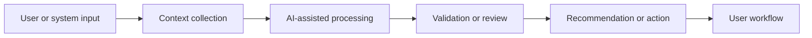

<!-- unified-readme:start -->
<div align="center">

# Intelligent Intune App Toolbox

**Archived AI-assisted toolbox for Microsoft Intune app deployment and automation experiments.**

Build. Automate. Share.

[](https://github.com/JayRHa/IntelligentIntuneAppToolbox/stargazers)
[](https://github.com/JayRHa/IntelligentIntuneAppToolbox/network/members)
[](https://github.com/JayRHa/IntelligentIntuneAppToolbox/issues)
[](https://github.com/JayRHa/IntelligentIntuneAppToolbox/graphs/contributors)

---

`AI-assisted Operations` | `Python` | `Public` | `Archived`

</div>

## What is this?

Intelligent Intune App Toolbox explores AI-assisted workflows where prompts, context, and automation logic help with endpoint or operations tasks.

## Project Context

- Use it as a reference for combining automation with model-assisted analysis or responses.
- The important design boundary is keeping deterministic automation separate from model-generated output.
- This repository is archived and kept as a reference implementation.

## How It Works

Input is collected from the user or system, enriched with context, sent through AI-assisted processing, then converted into a recommendation, response, or automation step.



## Quick Start

1. Review the project context and workflow below.
2. Clone the repository:

   ```bash
   git clone https://github.com/JayRHa/IntelligentIntuneAppToolbox.git
   ```

3. Continue with the setup, usage, or workflow sections below.

---
<!-- unified-readme:end -->

# IntelligentIntuneAppToolbox
